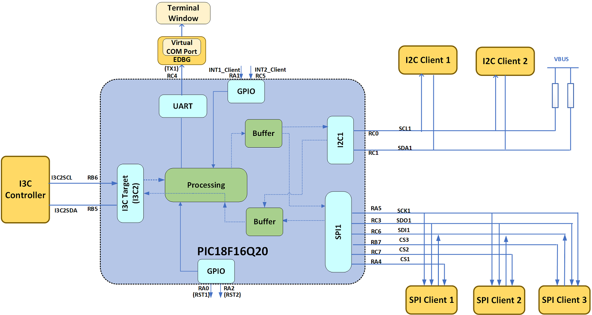
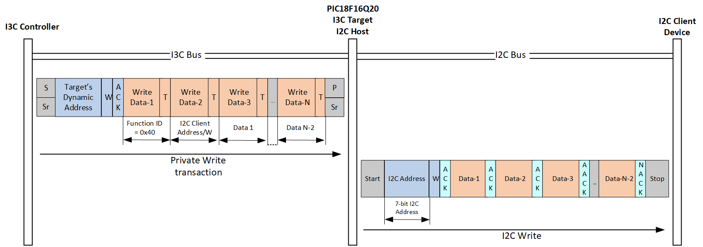
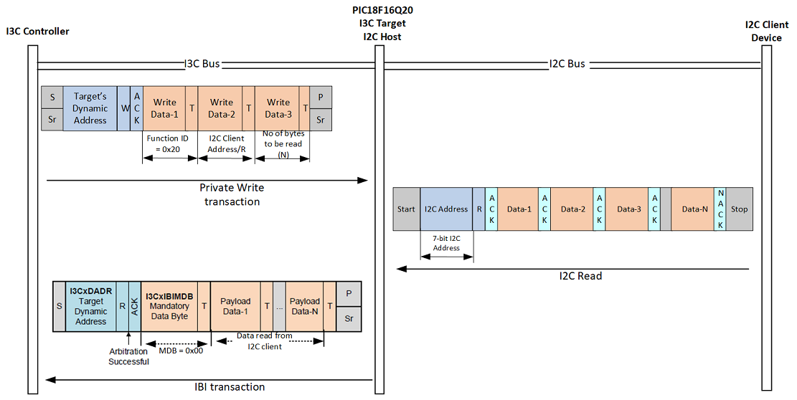
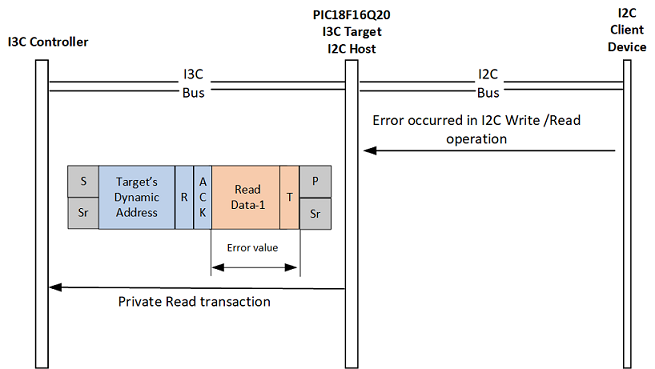
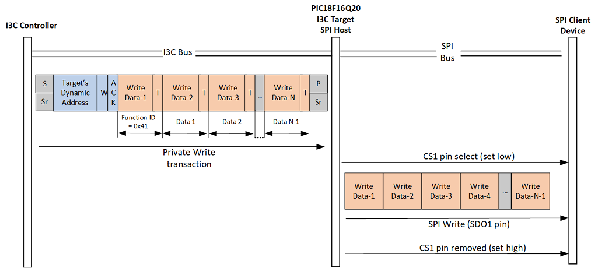
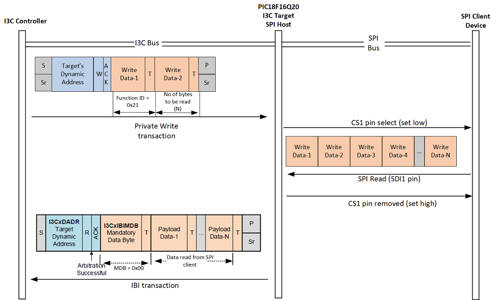
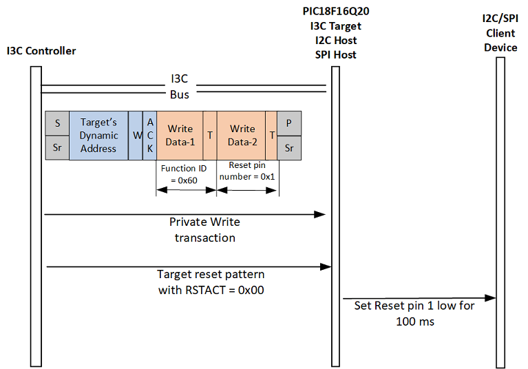
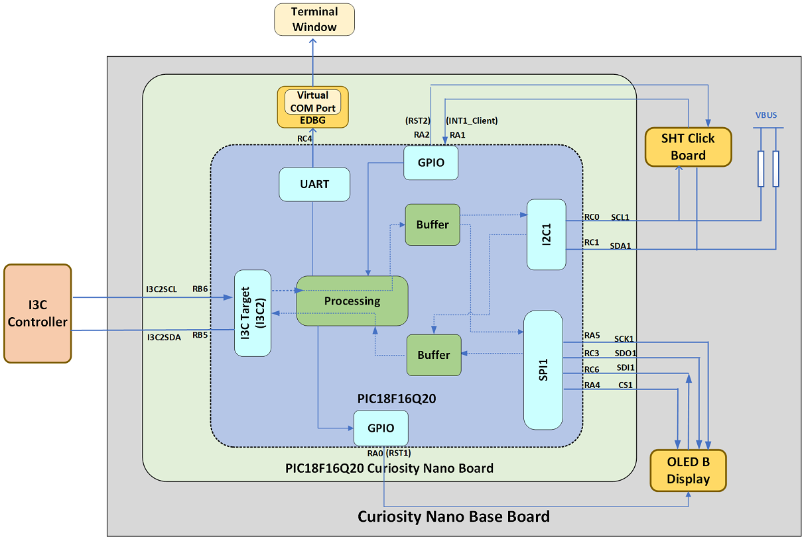
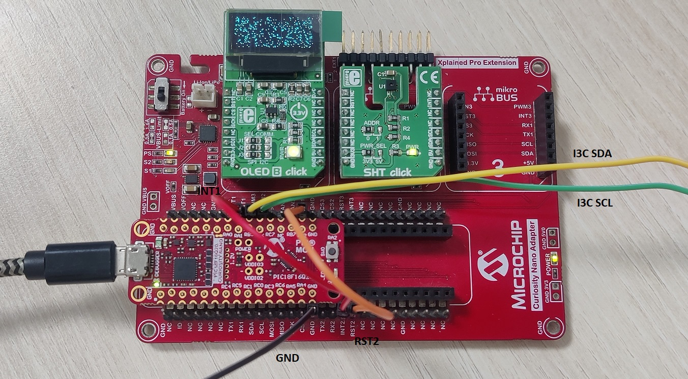

# I3C Multi-Protocol Translator Using PIC18F16Q20 Microcontroller

## Introduction
This example showcases how the Improved Inter-Integrated Circuit® (I3C) Target peripheral of the PIC18F16Q20 family serves as a bridge device between I3C Controller and Inter-Integrated Circuit (I2C) or Serial Peripheral Interface (SPI) devices. This document is divided into two sections, one covers the implementation of multi-protocol translator using PIC18F16Q20 and the other covers an application example.

## Implementation of Multi-Protocol Translator

### Overview
I3C interface provides a fast, low-power managed two-wire digital interface to improve sensor and device integration. Most of the sensors, displays, and other client devices communicate over I2C or SPI interface. The I3C Target module isolates the I2C/SPI client devices from a pure I3C bus. This maintains the integrity of the I3C bus, while still allowing the I3C controller to communicate to the I2C/SPI devices through the PIC18F16Q20 microcontroller.

In this example, the I3C-I2C/SPI protocol translator demonstrates the following functionalities:
1.	The I3C Controller can write to I2C and SPI devices
2.	The I3C Controller can read from I2C and SPI devices
3.	Interrupts generated by I2C/SPI devices using external signals is relayed to I3C Controller
4.	The I3C Controller can reset the client devices connected over I2C, SPI bus

### Features

This section explains the features of multi-protocol translator using PIC18F16Q20 as per the current firmware implementation. This can be enhanced based on the application requirement.

- I3C Target with 64MHz input clock
- I3C bus operating voltage range (0.95V - 1.62V)
- I2C host interface operating up to 100 kHz
- SPI host interface operating at 250 kHz
- SPI and I2C bus operates at device VDD
- Supports 7-bit I2C client addressing
- SPI Mode 0
- Two General Purpose Input/Output (GPIO) pins for detecting interrupts from I2C/SPI client devices
- Two GPIO pins for resetting client devices
- Three Chip Select pins. Can connect up to three SPI client devices.
- 500 byte buffer to transmit data to Controller
- 503 byte buffer to receive data from Controller
- One byte buffer to send error signal to Controller
- Supports maximum of 500 bytes of data in I2C/SPI bus

### Block Diagram

### Related Documentation
- [PIC18F16Q20 Product Page](https://www.microchip.com/product/PIC18F16Q20)
- [PIC18F16Q20 Data Sheet](https://www.microchip.com/DS40002387)
- [Datasheet SHT3x-DIS](https://download.mikroe.com/documents/datasheets/SHT31-DIS_datasheet.pdf)
- [How to use Alert Mode of SHT3x-DIS](https://sensirion.com/media/documents/40D749F7/616400BB/Sensirion_Humidity_Sensors_SHT3x_Application_Note_Alert_Mode_DIS.pdf)

### Software Used
- [MPLAB® X IDE v6.15](https://www.microchip.com/mplab/mplab-x-ide) or newer
- [XC8 Compiler 2.45](https://www.microchip.com/mplab/compilers) or newer
- [MPLAB® Code Configurator (MCC) 5.3.7](https://www.microchip.com/mplab/mplab-code-configurator) or newer
- [Microchip PIC18F-Q Series Device Support 1.20.405](https://packs.download.microchip.com/) or newer

### Pin Connection Table

**Note:** The SCL and SDA pins of I3C (I3C2) are powered by VDDIO3 pins. In the current firmware, Configuration Byte 7 is configured such that VDDIO3 is in the low-voltage operating range of 0.95V-1.62V.

|Microcontroller Pin| Name | Description |
|:------------------:|:-----------------:|:------:|
| RB6| I3C2SCL | I3C bus serial clock input |
| RB5| I32SDA | I3C bus serial data input/output |
| RC4| TX1| UART transmit output pin|
| RA5 | SCK1| SPI serial clock output|
| RC3 | SDO1| SPI serial data out|
| RC6 | SDI1|SPI serial data in|
| RA4| CS1| SPI client select 1 output(Active low)|
| RC7 | CS2|SPI client select 2 output(Active low)|
| RB7 | CS3|SPI client select 3 output(Active low)|
| RC0 | SCL1|I2C bus serial clock output |
| RC1 | SDA1|I2C bus serial data input/output |
| RA1 | INT1_Client|Interrupt pin 1 (Active high input). Interrupt occurs when there is a positive edge |
| RC5 | INT2_Client|Interrupt pin 2 1 (Active high input). Interrupt occurs when there is a positive edge|
| RA0 |RST1| Reset pin 1 (Active low output). Resets the client device by setting pin low |
| RA2 | RST1|Reset pin 2 (Active low output). Resets the client device by setting pin low |

**Note:**
1. If PIC18F16Q20 Curiosity Nano board is used, then pin RC5 overlaps with the on-board debugger RX pin. If this pin need to be used as a interrupt pin, use an external UART-USB converter to print messages.

### Functional Description

The PIC18F16Q20 operates as an I3C Target, I2C host and SPI host. After initialization, the I3C Target generates a Hot-join request to an I3C bus and get dynamic address assigned. The I3C Controller will initiate a Read, Write, or Reset for the I2C/SPI client devices by sending certain commands to the I3C Target through a Private Write transaction. In a Private Write transaction, the first byte of payload is a Function ID. The Function ID consists of the client ID of I2C/SPI devices and the commands.

|Bit| Description |
|:------------------|:-----------------|
| b7: Res| Reserved |
| b6:5: Command [1:0] | 00-Reserved 01-Read 10-Write 11-Client Reset  |
| b4:3: Res| Reserved|
| b:2:0 Client ID [2:0] | 000– I2C device (The address of the I2C device should follow in the next byte)  001 ,010….111 – Identifier for each SPI device. b0 = 1, CS1 is selected   b1 = 1, CS2 is selected  b2 = 1, CS3 is selected|

PIC18F16Q20 decodes the Function ID to decide what actions to perform. For instance, if the controller wants to write to an I2C client device, it must send a Private Write transaction with the first byte as 0x20 followed by the I2C client address and the data to be send. PIC18F16Q20 decodes the first byte and initiates a I2C write operation.

**Note**:
1. The I3C controller must be aware of the I2C client address, the CS pin corresponding to SPI client and the  client devices connected to reset and interrupt pins.
2. PIC18F16Q20 acts as a pure protocol translator transferring data between I3C Controller and client devices. It does not process any data received.

The multi-protocol translator performs the below operations:.

#### I2C Write

The I3C controller wants to send data to an I2C client device.

#### I2C Read

The I3C Controller wants to read data from an I2C Client device.

#### Error Reporting in I2C Write/Read

If any error occurs during the I2C Write/Read, the error signal (1 byte of data) is sent to the controller via Private Read transaction. The controller can request for a private read to know the status of the previous I2C transaction.

|Error signal value|Description|
|:-----------------:|:---------:|
|0x1|I2C bus time out error|
|0x2|I2C time out error during Read/Write|
|0x3|I2C client returned address NACK |
|0x4|I2C client returned data NACK|
|0x5|I2C bus collision error|

#### SPI Write

The I3C Controller wants to write data to a SPI client device.

#### SPI Read

The I3C Controller wants to read data from an I2C Client device.

#### Interrupts from client devices

There are two dedicated GPIOs for monitoring the interrupts from two client devices. The interrupt pins on sensors or other client devices can be connected to these GPIOs. Whenever a rising edge is detected on the either of the pins, the I3C Target  module sends an IBI request to I3C Controller.

The mandatory byte (MDB) in an IBI payload have information about interrupt pin number which tells the controller from which client device the interrupt has occurred.

|MDB value|Description|
|:-----------------:|:---------:|
|0x1|Interrupt occurred on client interrupt pin connected to RA1|
|0x2|Interrupt occurred on client interrupt pin connected to RC5|

#### Reset client devices

The PIC18F16Q20 provides two dedicated pins for resetting the client devices. The reset pin on sensors or other client devices can be connected to these GPIOs. These pins are by-default high.

|RST signal value|Description|
|:-----------------:|:---------:|
|0x1|Reset client whose RST pin is connected to RA0|
|0x2|Reset client whose RST pin is connected to RA2|
|0x3|Reset clients whose RST pin is connected to RA0, RA2|

Once target reset pattern is detected, PIC18F16Q20 will perform reset action based on the value of target reset action.

|RSTACT |Description|
|:-----------------:|:---------:|
|0x00|Sets reset pin low for 100ms. This resets the client device connected to respective reset pin |
|0x01| Reset of I3C Target peripheral only|
|0x01| Reset of PIC18F16Q20|

### Peripheral Configuration Using MCC
This section explains how to configure the peripherals using MPLAB X IDE with MCC plugin to recreate this project.

Refer to the [Software Used](https://github.com/microchip-pic-avr-examples/pic16f17146-force-sensing-resistor-interface-mplab-mcc#software-used) section to install required tools to recreate the project.

Additional Links: [MCC Melody Technical Reference](https://onlinedocs.microchip.com/v2/keyword-lookup?keyword=MCC.MELODY.INTRODUCTION&redirect=true)

##### Peripheral Configuration Summary

| Peripherals               | Configuration                                                                                                                                                                                                                                                                                                                                                                                                  | Usage                                                                         |
|---------------------------|----------------------------------------------------------------------------------------------------------------------------------------------------------------------------------------------------------------------------------------------------------------------------------------------------------------------------------------------------------------------------------------------------------------|-------------------------------------------------------------------------------|
|    Clock Control    |    Clock source –   HFINTOSC HF Internal Clock – 64 MHz Clock Divider   – 1                                                                                                                                                                                                                                                                                                         |    System  clock                                                                     |
|    I3C_Target_DMA |  Tx DMA Channel Selection - DMA1  Rx DMA Channel Selection - DMA2  I3C PLIB Selector - I3C2  Transaction settings Hot-Join Capable - Enable  Default Private Transaction Acknowledge - Not acknowledge    *I3C2PLIB*   Enable Module Clock source Fosc Input Buffer (SDA and SCL Pins) - I3C Low Voltage(LV) Buffer    System Level Interrupt Settings Enable General Interrupt and Reset Interrupt   *Note: All the other configurations are retained with default selections*| Used as I3C Target|
|	 Pin Settings		  |    *Pin Grid View*  I3C2 I3C2SCL : RB6  I3C2SDA : RB5  I2C1 SCL1 : RC0  SDA1 : RC1  SPI1 SCK1 : RA5  SDI1 : RC6 SDO1 : RC3  UART1 TX1 : RC4  GPIO  Output : RA0, RA2, RA4, RC7, RB7   Input : RA1, RC5     *Pins*  RA1 Custom Name : INT1_Client  Interrupt on Change - positive  RC5 Custom Name : INT2_Client Interrupt on Change - positive  RA0 Custom Name : RST1 Start High   RC1 Custom Name : RST2 Start High   RA4 Custom Name : CS1  Start High  RC7 Custom Name : CS2  Start High  RB7 Custom Name : CS3  Start High  																																														|    Pin Configurations																	|
|    SPI1               |    Mode - Host SPI Mode: SPI Mode 0 Input Data Sampled At - Middle Requested Clock Frequency (Hz): - 2500000 Clock Source Selection - Fosc                 |    Used as SPI Host                                        |                             |
|    I2C1              |   Requested Speed - 100kHz  *I2C1_Peripheral  Clock Source Selection - Fosc Fast Mode - Standard Mode Enable Interrupt Driven   |   Used as I2C host      |                                                              
|    UART1                | *UART1 Driver*   Requested Baudrate – 9600  Enable Redirect Printf to UART  UART PLIB Selector – UART1        *UART1 PLIB*    Enable Transmit  Enable UART|    Send data to PC terminal   |
| Configuration Bits        | CONFIG7  VDDIO3 supply mode bit -Low-voltage Operating Range (VDDIO3 < 1.62V)   Update this to standard operating range if VDDIO3 > 1.62 V | Configuration Register|

**Note:** The on-board debugger present on Curiosity Nano board has a virtual serial port (CDC) connected to UART on the PIC18F16Q20, and provides an easy way to communicate with the target application through terminal software. Refer to the [Curiosity Nano board user guide](https://www.microchip.com/DS50003388) for more details.

## Application Example

This section demonstrates an application of  multi-protocol translator using PIC18F16Q20. In this example, the I3C controller communicates to a SHT click interfaced over I2C bus and OLED B display interfaced over SPI through the multi-protocol translator. The SHT click contains a SHT3x-DIS sensor which is used for measuring relative humidity and temperature. OLED B is used to display messages.

### Hardware Used
- [PIC18F16Q20 Curiosity Nano Board](https://www.microchip.com/en-us/development-tool/EV73T25A)
- [Curiosity Nano base board](https://www.microchip.com/development-tool/AC164162)
- [SHT Click](https://www.mikroe.com/sht-click)
- [OLED B Click](https://www.mikroe.com/oled-b-click)
- Any I3C Controller
- Logic Analyzer

### Setup

In this example, the Curiosity Nano Base Board connects the click boards to the PIC18F16Q20 Curiosity Nano board. The OLED B Click board™ is placed in click slot one and the SHT Click board™ is placed in click slot two. Connect pin RB6 to SCL pin of I3C Controller and connect pin RB5 to SDA pin of I3C Controller. As OLED B Click does not have a INT pin, interrupt pin 1 (INT1) is used to connect interrupt from SHT Click.

**Note:**
1. VDDIO3 pin of PIC18F16Q20 Curiosity Nano supplies power to I3C2 pins, which is by default at 1.2V. Therefore I3C bus operates at 1.2V. To operate I3C pins at a different voltage,  connect an external power supply to the J208 PIC18F16Q20 Curiosity Nano board. Remove R200 before connecting the external power supply to VDDIO3. The SPI and I2C bus operates at 3.3V.  
2. Connection from PIC18F16Q20 Curiosity Nano to the click slot is not available for RA2 pin. Jumper cable is used to make the required connection. Thus, short AN1 (RA2) and RST2, INT1 (RA1) and INT2 of Curiosity Nano Base Board.

### Operation

The I3C Controller must set up the I3C bus with desired frequency.
After power-up, the I3C Target makes a hot join request. It waits until the dynamic address is assigned by the controller. Once the dynamic address is assigned, it is ready to receive commands from the controller.

The below section explains the commands from the controller to communicate with SHT click and OLED B display in detail.

#### SHT Click

To capture temperature and humidity values from SHT3x-DIS sensor, I3C controller must first send a measurement command. With the acknowledgement of the measurement command, the sensor starts measuring humidity and temperature. Refer to [Datasheet of SHT3x-DIS](https://download.mikroe.com/documents/datasheets/SHT31-DIS_datasheet.pdf) for more details on the commands.

The measurement command triggers the acquisition of data pair. Each data pair consists of one 16 bit temperature and one 16 bit humidity value (in this order). After the sensor has completed the measurement, the controller can send a command to readout measurement results. The sensor will send two bytes of data (temperature, MSB first and then LSB) followed by one byte CRC checksum and another two bytes of data (relative humidity, MSB first and then LSB) followed by one byte CRC checksum.

After power-up, the INT pin on SHT click is set high by default, which can be cleared by sending a command to clear status register.

|Sensor Command|Hex Code|
|:-----------------:|:---------:|
|Clear status register|0x3041|

Send the below command from I3C Controller

|Controller Operation|Data 1|Data 2|Data 3|Data 4|
|:-----------------:|:---------:|:---------:|:---------:|:------:|
|I2C Write|0x40|0x88|0x24|0x00|

<b>Interrupt from the SHT click (Alert Mode)</b>

The  INT pin of SHT click is set high when the sensor measurement crosses the threshold limit. The INT pin connected to the GPIO (RA1) of PIC8F16Q20 generates an interrupt. The PIC18F16Q20 sends an IBI to controller informing that the threshold limit is crossed.

*Note*: The Alert mode is active only in periodic data acquisition mode.

The below commands are used to configure the set limit and clear limit of upper threshold values. Similarly lower threshold limit could be configured.

|Sensor Command|Hex code|
|:-----------------:|:---------:|
|Set limit|0x611D|
|Clear limit|0x6116|

Refer to [How to use Alert Mode of SHT3x-DIS](https://sensirion.com/media/documents/40D749F7/616400BB/Sensirion_Humidity_Sensors_SHT3x_Application_Note_Alert_Mode_DIS.pdf) to understand how to calculate the threshold limit values.

Send the below command from I3C Controller to configure upper threshold limits

|Threshold limit values  (Relative Humidity/Temperature)|Controller operation|Data 1|Data 2|Data 3|Data 4|Data 5|Data 6|Data 7|
|:--------:|:-----------------:|:---------:|:---------:|:---------:|:------:|:---------:|:---------:|:------:|
|80%/26oC|I2C Write|0x40|0x88|0x61|0x16|0xCC|0xCF|0xF6
|79%/28oC|I2C Write|0x40|0x88|0x61|0x1D|0xCC|0xD5|0x6E

<b>Measurement Command for Periodic Data Acquisition Mode</b>

|Sensor Command|Hex Code|
|:-----------------:|:---------:|
|Periodic data acquisition (At 2mps)|0x2236|

Once the threshold limits are set, send the measurement command for data acquisition. In periodic acquisition mode, one issued measurement command yields a stream of data pairs. The measurement commands in this mode differs based on the  data acquisition frequency.

 Send the below command from the I3C controller.

|Controller Operation|Data 1|Data 2|Data 3|Data 4|
|:-----------------:|:---------:|:---------:|:---------:|:------:|
|I2C Write|0x40|0x88|0x22|0x36|

<b>Readout of Measurement Results in Periodic Data Acquisition Mode</b>

|Sensor Command|Hex Code|
|:-----------------:|:---------:|
|Fetch Command|0xE000|

Transmission of the measurement data is initiated through the fetch data command. After the fetch command is sent from controller, the result is read out by sending an I2C Read command for reading six bytes of data.

|Controller Operation|Data 1|Data 2|Data 3|Data 4|
|:-----------------:|:---------:|:---------:|:---------:|:---------:|
|I2C Write|0x40|0x88|0xE0|0x00|
|I2C Read|0x20|0x89|0x06|-|

<b> Reset sensor </b>

Send the below command from controller to reset SHT click.

|Controller Operation|Data 1|Data 2|
|:-----------------:|:---------:|:-------:|
|I2C Write|0x60|0x02|

Followed by it, send a target reset pattern with RSTACT as 0x00. (SHT click reset is performed when no RESET action is set). The OLEB B display can also be reset similarly by replacing second data byte in the above command with 0x1.

#### OLED B display

To initialize, OLED B display send the following command from I3C controller. Refer the [OLED B Data sheet](http://download.mikroe.com/documents/datasheets/MI9639BO-B_datasheet.pdf) for more details on the commands.

The CS pin in OLED B click is connected to SPI CS1 pin (RA4) of PIC18F16Q20 and D/C control pin is connected to SPI CS2 pin (RC7). When sending a data, D/C control pin is set high. When sending a command, D/C pin must be set low. The client ID bits in function ID must be set appropriately based on whether data send in a SPI write must be treated as data or command.

|Controller Operation|Data 1|Data 2|Data 3|Data 4|Data 5|Data 6|Data 7|Data 8|Data 9|Data 10|Data 11|Data 12|Data 13|Data 14|Data 15|Data 16|Data 17|Data 18|Data 19|Data 20|Data 21|Data 22|Data 23|Data 24|
|:-----------------:|:---------:|:---------:|:---------:|:---------:|:-----------------:|:---------:|:---------:|:---------:|:---------:|:-----------------:|:---------:|:---------:|:---------:|:---------:|:-----------------:|:---------:|:---------:|:---------:|:---------:|:-----------------:|:---------:|:---------:|:---------:|:-------:|
|SPI Write|0x43|0xAE|0xD5|0x80|0xA8|0x27|0xA1|0xC8|0xD3|0x0|0x8D|0x14|0x40|0xDA|0x12|0x81|0xAF|0xD9|0x25|0xDB|0x20|0xA4|0xA6|0xAF|

To send any characters (eg send a "A") on the display, send the command in below format.

|Controller Operation|Data 1|Data 2|Data 3|Data 4|
|:-----------------:|:---------:|:---------:|:---------:|:---------:|
|SPI Write|0x43|0xB0|0x12|0x00|
|SPI Write|0x41|0xF8|-|-|
|SPI Write|0x43|0xB0|0x12|0x01|
|SPI Write|0x41|0x24|-|-|
|SPI Write|0x43|0xB0|0x12|0x02|
|SPI Write|0x41|0x22|-|-|
|SPI Write|0x43|0xB0|0x12|0x03|
|SPI Write|0x41|0x24|-|-|
|SPI Write|0x43|0xB0|0x12|0x04|
|SPI Write|0x41|0xF8|-|-|
|SPI Write|0x43|0xB0|0x12|0x05|
|SPI Write|0x41|0x0|-|-|
|SPI Write|0x43|0xB0|0x12|0x03|
|SPI Write|0x41|0x24|-|-|

### Steps to Open the Terminal Window in Data Visualizer

To see the debug messages of multi-protocol translator in terminal window, the Curiosity Nano board needs to be connected to terminal emulator.
Data Visualizer can be used as a terminal emulator. Follow the procedure mentioned below to open the Terminal window in Data Visualizer.

Open the Data Visualizer tool which is available as a plugin in MPLAB X IDE.
1.	Open **COM7** Settings window. Set the Baud Rate to 9600.
**Note:** The COM port number can be different depending on the availability of the port.
2.	Click the right aligned triangle symbol on **COM7** tab to start capturing.

*Note*: If debug messages are being printed on terminal, make sure to keep  delay between sending commands from controller. For faster execution of code, comment the below macro in application.c to stop printing debug messages in terminal.

#define DEBUG_PRINT_ON

## Summary
A multi-protocol translator is implemented using PIC18F16Q20 I3C Target module which converts I3C to I2C, and I3C to SPI protocol.
